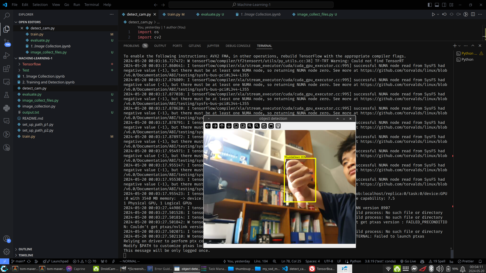
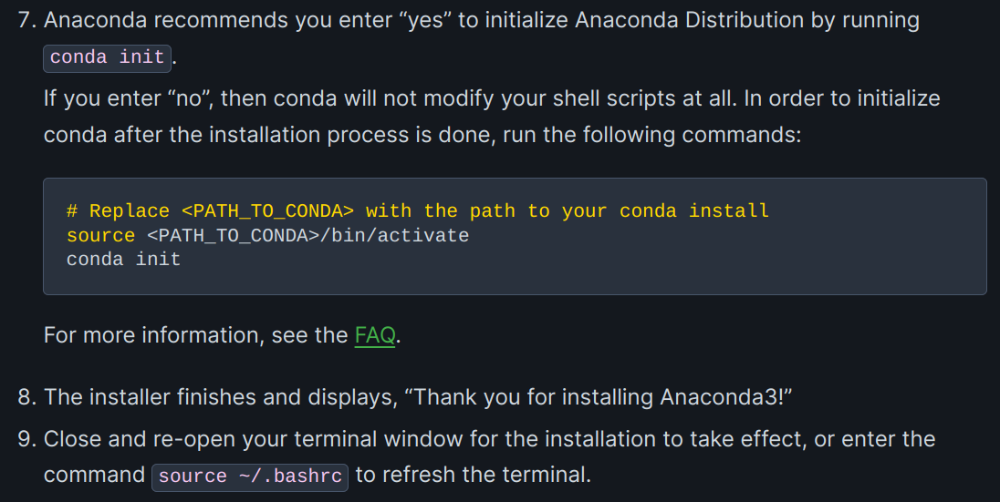
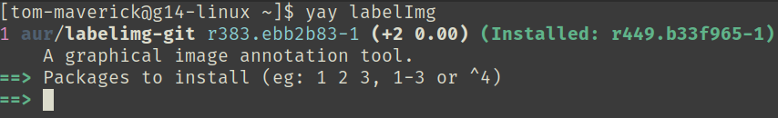
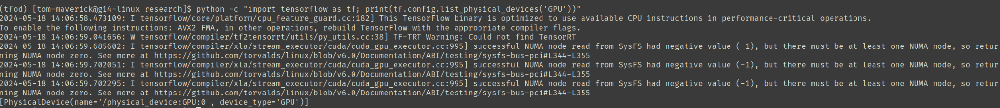
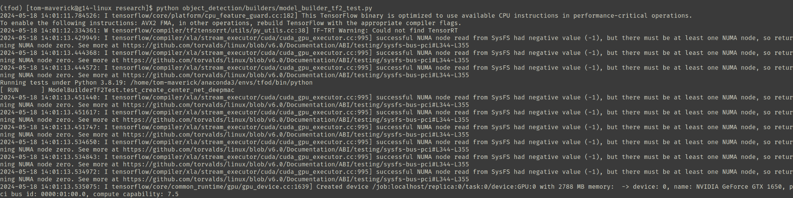
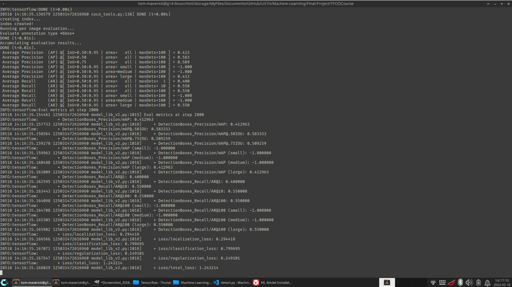

# ML Model Installation Steps
## Credits
Pham Xuan Hoang - hoangphamat0407@gmail.com
Bui Le Duc Anh - anhbld.22bi13010@usth.edu.vn
## Foreword
We are going to install all the dependencies beforehand, not as we go like in the tutorial. 

Run everything in the terminal, *not* in Jupyter Notebook or ~~VCCode terminal since we cannot change their path~~ (It stills work, make sure to set the path in the instructions below inside VSCode terminal)

**This script is written for Linux, you can try it on Windows but I don’t think it will work.**

Install `nvtop` to monitor the NVIDIA GPU usage (you can try `amdgpu_top` for AMD GPU).
## Demo

## Setup the environment
### Step 1: Install Anaconda
Take notice at step 7 in the Anaconda wiki


- Select no to only load anaconda when we need, this should avoid any complications later on
- We will activate conda by typing: 
```bash
eval "$(/home/$USER/anaconda3/bin/conda shell.bash hook)"
```

Disable conda when finish everything by typing:
``` bash
conda deactivate
```

### Step 2: Create environment
Install `conda env` to isolate all the dependencies from the main system. This should allow us to redo this section as many times as we need without breaking the host system.

``` bash
conda create -n tfod python=3.8
```

We activate this env by:

``` bash
conda activate tfod
```

Take notice of Python version **3.8**, this is *the only version that I found is compatible with our codebase*, the rest are either too old or too new and cause compatibility issues due to library mismatch.

Install the following dependencies to ensure that we can use the TF `object_detection` module.

```bash
conda install -c conda-forge cudatoolkit=11.8
conda install -c conda-forge cudnn
conda install -c nvidia cuda-nvcc=11.8
```

### Step 3: Set up path for cuda
By default, Tensorflow **cannot** see the cuda library we just installed, which is stupid at best.
We are going to add it to the **current session path**, remember to run this only once after you activate the Anaconda environment else **Tensorflow will run on CPU**.


```bash
export LD_LIBRARY_PATH=/home/$USER/anaconda3/envs/tfod/lib:$LD_LIBRARY_PATH
```


Run this to check: 
``` bash
echo "LD_LIBRARY_PATH set to: $LD_LIBRARY_PATH"
```

If you accidentally add the path more than one time, revert by either close the terminal and source the command above again or run this (not guarantee to work on your system)

``` bash
export LD_LIBRARY_PATH=$(echo $LD_LIBRARY_PATH | sed -e 
"s|/home/$USER/anaconda3/envs/tfod/lib:||" -e 
"s|:/home/$USER/anaconda3/envs/tfod/lib||" -e 
"s|/home/$USER/anaconda3/envs/tfod/lib||")
```

### Step 4: Install `labelImg`
The source for this application is quite old and therefore might not work on newer Linux distributions. It usually crashes with floating-point error when attempting to select a picture.
If you are using a non-Arch distribution, you’ll have to either **build it from source** or **check your package distributor** for a pre-build package.
For Arch-based distribution, search for `labelImg` using an AUR-helper like `yay`.



## Image Collection
### Step 1: Setup Python packages through PIP
This part is for **image collecting only**, we will do another one for the **training** part.

``` bash
pip install opencv-python
```
That’s all for now.

### Step 2: Set up path
Simply `run set_up_path_p1.py` to create the necessary folder.
### Step 3: Capture images
Run `image_collection.py` to start the capturing process. In my code, press **Enter** to begin, then press space to capture the image, do that until there are no images left.
### Step 4: Image labeling
Do the same as in the video, except we have already install `labelImg` above, there is no need to build it anymore.

**Warning:**
- Remember to split it into two folders: train and test
- Use **w** to select region and **CTRL + s** to save *(remember to save the result)*
- Use the correct label like in the video: ThumbsUp, ThumbsDown, ThankYou, LiveLong
## Training and Detection
### Step 1: Set up the path
Simply run `set_up_path_p2.py`

It’s a bit different from the one above, this will set up the path as usual and download the TF Models from Tensorflow Model Zoo.

**Important: Install TensorRT if you have an RTX series card (you can try this, it doesn’t work on my GTX 1650 so I can’t test this). Tensorflow will still run just fine without it.**

``` bash
pip install nvidia-pyindex
pip install nvidia-tensorrt
```

**Debug**: https://github.com/NVIDIA-AI-IOT/torch2trt/issues/429
### Step 2: Install Object Detection API with TensorFlow 2
We will do everything **according to their repo**, not the one in the Jupyter Notebook since it will fail the `PIP` dependencies check thus fail to build.

``` bash
# Move to the Object Detection Source Code folder
cd Tensorflow/models/research
# Compile protos.
protoc object_detection/protos/*.proto --python_out=.
# Install TensorFlow Object Detection API.
cp object_detection/packages/tf2/setup.py .
python -m pip install .
```

Run a test to ensure that we can use the GPU :

``` bash
python -c "import tensorflow as tf; print(tf.config.list_physical_devices('GPU'))"
```



It should return something like this (if failed, come back to step 3 of Setup the environment):
``` python
[PhysicalDevice(name='/physical_device:GPU:0', device_type='GPU')]
```

Then we test the installation:
``` bash
python object_detection/builders/model_builder_tf2_test.py
```

You should see something like this:


Notice the NVIDIA Geforce GTX 1650, yours might be different.

Step 2.5: Configure GPU
Go to this path:
``` bash
cd Tensorflow/models/research/object_detection
```

Edit this file: `model_main_tf2.py`, I have added the necessary code to increase the VRAM available to Tensorflow, you only have to change it based on your GPU.

This is for the `training.py`; for the `detect_cam.py`, just change directly in the file.
``` python
gpus = tf.config.list_physical_devices('GPU')
if gpus: 
    try:
        for gpu in gpus:
            tf.config.experimental.set_memory_growth(gpu, True)
        tf.config.set_logical_device_configuration(
            gpus[0],
            [tf.config.LogicalDeviceConfiguration(memory_limit=3940)]
        )
        logical_gpus = tf.config.list_logical_devices('GPU')
        print(len(gpus), "Physical GPU,", len(logical_gpus), "Logical GPUs")
    except RuntimeError as e:
        print(e)
```

You need to change the `memory_limit` to increase your graphics card VRAM, it should help boost the performance somewhat since by default Tensorflow seems to only use 2988MB.

If you get this ERROR: 
``` bash
tensorflow/compiler/xla/stream_executor/cuda/cuda_driver.cc:753] failed to allocate 3.71GiB (3984588800 bytes) from device: CUDA_ERROR_OUT_OF_MEMORY: out of memory
```

Either close any program that is using the NVIDIA GPU or reduce the amount VRAM allocate in the file above
### Step 3: Train
Run `train.py`, it will take a while, you can ignore most of the deprecated warnings but pay attention if the output stops **midway**, something might have gone wrong.

Change `--num_train_steps=2000` at line **75** to how many iterations you want.

After the training is completed, the terminal output will stop, but it won’t quit, if you see the Model evaluation below, it should have completed successfully. (Or pay attention to the GPU usage, it might have dropped to 0%)




### Step 4: Detection using camera
**CONNECT the camera or make sure it is turned on else you will get:**
``` bash
ValueError: 'images' must have either 3 or 4 dimensions.
```


Simply run the `detect.py` and enjoy.
Debug:
``` bash
Traceback (most recent call last):
  File "detect_cam.py", line 99, in <module>
    cv2.imshow('object detection',  cv2.resize(image_np_with_detections, (800, 600)))
cv2.error: OpenCV(4.9.0) /io/opencv/modules/highgui/src/window.cpp:1272: error: (-2:Unspecified error) The function is not implemented. Rebuild the library with Windows, GTK+ 2.x or Cocoa support. If you are on Ubuntu or Debian, install libgtk2.0-dev and pkg-config, then re-run cmake or configure script in function 'cvShowImage'
```

Solve by running this line-by-line:
``` bash
pip uninstall opencv-python-headless
pip install opencv-python --upgrade
```
